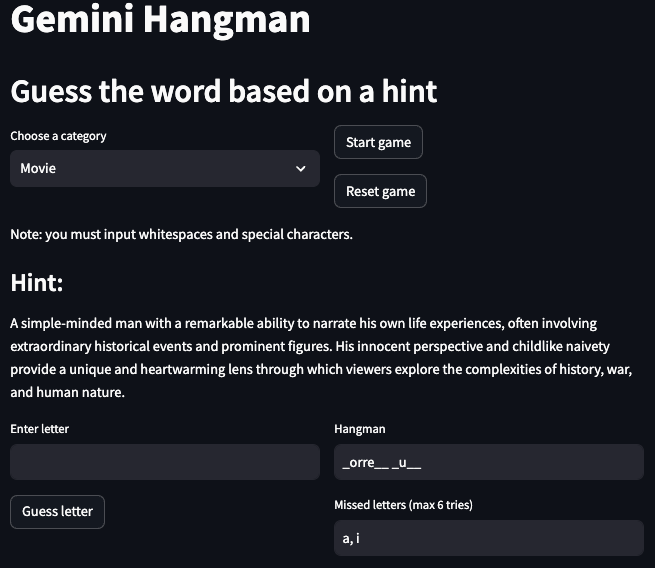
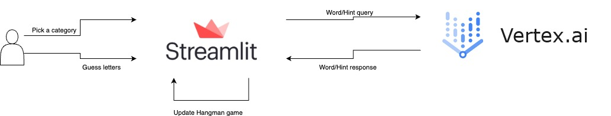

# Gemini Hangman Game

---

This is a take on the classic [Hangman game](https://en.wikipedia.org/wiki/Hangman_(game)) using Generative models (in the form of [Google's Gemini](https://gemini.google.com/app)), taking advantage of the powerful and easy access of the [Vertex AI](https://cloud.google.com/vertex-ai) API and the flexibility of [Streamlit](https://streamlit.io) apps.

You have two versions of this APP, one using the Vertex AI API as the backend, and the other one runs an open source model locally as the backend (Gemma 2b by default), from my experiments the Vertex AI API yields better results.



# Hangman game workflow

The workflow of this application is quite simple and it can be explained in a few steps:
1. User selects a category and starts the game.
   - At any time the user may restart the game and choose another category.
2. Vertex AI requests a word from Gemini based on the category.
3. Vertex AI requests a text hint from Gemini based on the word.
4. The App displays the text hint to the user and the Game is ready to be played.
5. User inputs a letter as a guess
6. If the letter is part of the secret word, the hangman puzzle is updated, otherwise it loses one try.
7. If the user correctly guesses all letters from the secret word, it wins, if all tries are lost, the user loses.



# Usage
The recommended approach to use this repository is with [Docker](https://docs.docker.com/), but you can also use a custom venv, just make sure to install all dependencies.

## Configs
```
model: gemini-1.0-pro-001
project: {VERTEX_AI_PROJECT}
location: {VERTEX_AI_LOCALTION}
generation_config:
  max_output_tokens: 1024
  temperature: 1
  top_p: 1
  top_k: 32
os_model: google/gemma-2b-it
device: cpu
```
- **model:** Model name used by Vertex AI.
- **project:** Project name used by Vertex AI.
- **location:** Project location used by Vertex AI.
- **generation_config**
  - **max_output_tokens:** Maximum number of tokens generated by the model.
  - **temperature:** Temperature controls the degree of randomness in token selection. Lower temperatures are good for prompts that expect a true or correct response, while higher temperatures can lead to more diverse or unexpected results. With a temperature of 0 the highest probability token is always selected.
  - **top_p:** Top-p changes how the model selects tokens for output. Tokens are selected from most probable to least until the sum of their probabilities equals the top-p value. For example, if tokens A, B, and C have a probability of .3, .2, and .1 and the top-p value is .5, then the model will select either A or B as the next token (using temperature).
  - **top_k:** Top-k changes how the model selects tokens for output. A top-k of 1 means the selected token is the most probable among all tokens in the model’s vocabulary (also called greedy decoding), while a top-k of 3 means that the next token is selected from among the 3 most probable tokens (using temperature).
- **os_model:** Open source model used for the queries by the open source version of the app.
- **device:** Backend device used by the open source model, usually one of (cpu, cuda, mps)

## Commands

Start the Streamlit app with the Hangman game with Vertex AI API backend.
```bash
make app
```

Start the Streamlit app with the Hangman game with Open source models backend.
```bash
make app_os
```

Build the Docker image.
```bash
make build
```

Apply lint and formatting to the code (only needed for development).
```bash
make lint
```

# References
- [How to setup Google Cloud credentials locally](https://cloud.google.com/docs/authentication/provide-credentials-adc#local-dev)
- [Where to find your local Google Cloud credentials](https://cloud.google.com/docs/authentication/application-default-credentials#personal)
- [Gemma-2b-it model card](https://huggingface.co/google/gemma-2b-it)